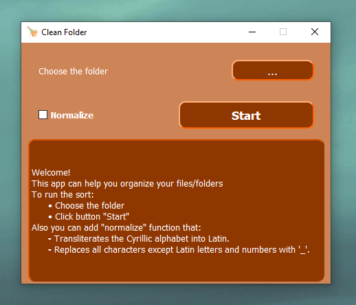

# CleanFolder_App
This app is for organizing your files/folders. 
Also there is an additional function to normalize the file name.

This app demonstrates my basic skills in Python and the PyQt5 graphics library.

Download source code: [here](https://github.com/andriyseeker22856/CleanFolder_App/releases/tag/clean_folder)
Run main.py in app folder to run app.
